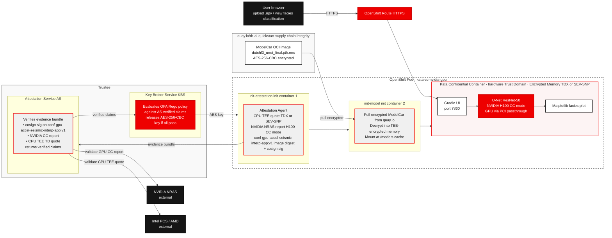

# Confidential GPU-Accelerated Seismic Interpretation

AI-powered rock type classification from North Sea seismic data — running with a three-factor attested, encrypted model in a confidential container on OpenShift AI. Upload a `.npy` seismic section and receive a colour-coded facies classification in seconds.

## Table of contents

- [Detailed description](#detailed-description)
  - [Who is this for?](#who-is-this-for)
  - [The business case for AI-driven seismic interpretation](#the-business-case-for-ai-driven-seismic-interpretation)
  - [What this quickstart provides](#what-this-quickstart-provides)
  - [What you'll build](#what-youll-build)
  - [Architecture diagram](#architecture-diagram)
- [Requirements](#requirements)
  - [Minimum hardware requirements](#minimum-hardware-requirements)
  - [Minimum software requirements](#minimum-software-requirements)
  - [Required user permissions](#required-user-permissions)
- [Deploy](#deploy)
  - [Clone the repository](#clone-the-repository)
  - [Part 1: Platform setup (cluster-admin, once per cluster)](#part-1-platform-setup-cluster-admin-once-per-cluster)
    - [Step 1: Install Node Feature Discovery](#step-1-install-node-feature-discovery)
    - [Step 2: Install OpenShift Sandboxed Containers](#step-2-install-openshift-sandboxed-containers)
    - [Step 3: Install the Trustee operator](#step-3-install-the-trustee-operator)
    - [Step 3a: Create the kbs-auth-public-key Secret](#step-3a-create-the-kbs-auth-public-key-secret)
    - [Step 3b: Create the trustee-tls-cert Secret](#step-3b-create-the-trustee-tls-cert-secret)
    - [Step 4: Deploy KBS](#step-4-deploy-kbs)
    - [Step 5: Expose the KBS route](#step-5-expose-the-kbs-route)
    - [Step 6: Configure the attestation policy](#step-6-configure-the-attestation-policy)
    - [Step 7: Confirm kata runtimeClass is available](#step-7-confirm-kata-runtimeclass-is-available)
    - [Step 8: Register app-specific secrets with KBS](#step-8-register-app-specific-secrets-with-kbs)
  - [Part 2: Application deployment (namespace admin)](#part-2-application-deployment-namespace-admin)
    - [Step 1: Create the project](#step-1-create-the-project)
    - [Step 2: Deploy the application](#step-2-deploy-the-application)
    - [Step 3: Get the application URL](#step-3-get-the-application-url)
  - [Use the application](#use-the-application)
    - [Upload seismic data](#upload-seismic-data)
    - [Run classification](#run-classification)
    - [View results](#view-results)
  - [Verify confidential execution (Optional)](#verify-confidential-execution-optional)
  - [Optional: Encrypt and publish your own model](#optional-encrypt-and-publish-your-own-model)
  - [What you've accomplished](#what-youve-accomplished)
  - [Delete](#delete)
- [Tags](#tags)

---

## Detailed description

### Who is this for?

This quickstart is designed for:

- **Petroleum engineers and geoscientists** who want to see AI applied to real subsurface field data without building a pipeline from scratch
- **Data scientists and ML engineers** exploring GPU-accelerated deep learning in the geoscience domain
- **Platform and security engineers** demonstrating confidential computing with GPU passthrough on OpenShift — using real, sensitive-class data as the workload

No prior seismic interpretation experience is required. Domain context is provided where needed.

### The business case for AI-driven seismic interpretation

Before drilling a well, geoscientists must answer a fundamental question: **where is the reservoir rock?**

The traditional answer involves a geologist manually interpreting a 3D seismic volume — tracing rock boundaries line by line through thousands of 2D cross-sections. A full field interpretation takes **weeks to months** of senior geologist time and reflects a single interpreter's judgement.

AI-driven seismic facies classification changes this:

| | Manual interpretation | AI model (this quickstart) |
|---|---|---|
| Time to full-field interpretation | Weeks–months | Minutes |
| Coverage | Sampled 2D sections | Every point in the 3D volume |
| Consistency | Interpreter-dependent | Deterministic |
| Cost | Senior geologist time | GPU compute |
| Scenario runs | 1–2 | Unlimited |

**The downstream impact is significant.** A better rock type map leads to better well placement decisions — and a single well in the North Sea costs $50M–$150M to drill. AI-assisted interpretation directly reduces the risk of drilling in the wrong location.

**Why confidential computing matters here.** Seismic data is among the most commercially sensitive assets an oil and gas company owns. Running AI interpretation on proprietary field data in a shared cloud or on-premises cluster exposes that data to the underlying infrastructure. Confidential computing hardware encrypts the memory of the inference process — the seismic data and model weights are never visible to the host OS, hypervisor, or other tenants, even with physical access to the node. This quickstart uses Intel® TDX (Trust Domain Extensions) for CPU memory encryption, but the same pattern applies to AMD SEV-SNP on AMD EPYC platforms. The NVIDIA H100 extends this protection to the GPU: when running in Confidential Computing mode, GPU memory and the PCIe bus between CPU and GPU are also encrypted, closing the gap that would otherwise exist between the CPU Trust Domain and the accelerator.

**Why an encrypted model matters.** The pre-trained U-Net ResNet-50 model is published to quay.io as an encrypted ModelCar OCI image. The AES-256-CBC decryption key is held by a Key Broker Server (KBS) that will only release it after three independent attestation checks pass: the **application container** (`quay.io/rh-ai-quickstart/conf-gpu-accel-seismic-interp-app:v1`) must be signed by the model owner — proving that the code receiving the key is trusted — the GPU must be confirmed to be running in NVIDIA Confidential Computing mode, and the CPU must be confirmed to be running in a hardware-verified Trust Domain (Intel® TDX or AMD SEV-SNP). The ModelCar image is signed separately to verify the integrity of the encrypted artifact in the registry. Together, this means the model weights are protected both at rest (encrypted in the registry) and in transit (decrypted only inside the hardware Trust Domain by a specific, verified application), and the inference workload cannot be redirected to an unattested or untrusted container.

### What this quickstart provides

- ✓ A browser-based application for uploading, classifying, and visualising seismic data — no command line required
- ✓ A U-Net ResNet-50 model trained on the Dutch F3 benchmark dataset (MIT license — commercial use permitted), published as an AES-256-CBC encrypted ModelCar OCI image at `quay.io/rh-ai-quickstart/conf-gpu-accel-seismic-interp-model:v1`
- ✓ A [Trustee](https://github.com/confidential-containers/trustee) Key Broker Server that enforces a three-factor attestation policy before releasing the model decryption key
- ✓ Inference running inside a **Kata confidential container** backed by **Intel® TDX or AMD SEV-SNP** — seismic data and decrypted model weights protected in encrypted memory
- ✓ GPU passthrough to the hardware Trust Domain via `kata-cc-nvidia-gpu` runtime
- ✓ Colour-coded facies cross-section displayed in the browser alongside the seismic input
- ✓ A `make encrypt-model` target for publishing your own encrypted, signed ModelCar (see [Optional: Encrypt and publish your own model](#optional-encrypt-and-publish-your-own-model))

### What you'll build

A containerised web application running on OpenShift that:

1. Pulls an encrypted ModelCar OCI image from `quay.io/rh-ai-quickstart/conf-gpu-accel-seismic-interp-model:v1`
2. Verifies a three-factor attestation policy via the Key Broker Server — the application container (`conf-gpu-accel-seismic-interp-app:v1`) must be cosign-signed by the model owner, the GPU must be in NVIDIA CC mode, and the CPU must be in a hardware TEE (Intel® TDX or AMD SEV-SNP) — and receives the AES-256-CBC decryption key only if all three pass
3. Decrypts the model weights inside the hardware Trust Domain — in encrypted memory, never on disk in plaintext
4. Presents a browser UI where a user uploads a `.npy` seismic section (depth × crossline, float32)
5. Runs U-Net ResNet-50 inference on a GPU, classifying every pixel as one of six North Sea rock types
6. Displays a colour-coded facies classification alongside the seismic input in the browser

#### Key technologies you'll learn

**Data**
- [Dutch F3 Benchmark Dataset](https://doi.org/10.5281/zenodo.3755060) — open North Sea seismic benchmark with six annotated facies classes (MIT license)

**Model**
- U-Net ResNet-50 ([segmentation-models-pytorch](https://github.com/qubvel/segmentation_models.pytorch)) — trained on the Dutch F3 benchmark dataset for six-class seismic facies segmentation (MIT license)
- [ModelCar](https://developers.redhat.com/articles/2024/10/22/how-to-use-modelcar-serve-ai-models-openshift-ai) — OCI image pattern for packaging and distributing model artifacts through a standard container registry

**Confidential computing**
- [Intel® TDX (Trust Domain Extensions)](https://www.intel.com/content/www/us/en/developer/tools/trust-domain-extensions/overview.html) or [AMD SEV-SNP](https://www.amd.com/en/developer/sev.html) — hardware-level CPU memory encryption for the inference process
- [NVIDIA Confidential Computing](https://www.nvidia.com/en-us/data-center/solutions/confidential-computing/) — H100 GPU running in CC mode, attestation via NVIDIA Remote Attestation Service (NRAS)
- [Kata Containers](https://katacontainers.io/) with `kata-cc-nvidia-gpu` runtime — GPU passthrough into the hardware Trust Domain
- [Trustee (KBS)](https://github.com/confidential-containers/trustee) — Key Broker Server enforcing three-factor attestation before releasing the model decryption key
- [Cosign / Sigstore](https://docs.sigstore.dev/cosign/overview/) — container image signing, verified as part of the KBS attestation policy

**Platform**
- [Red Hat OpenShift](https://www.redhat.com/en/technologies/cloud-computing/openshift) with the OpenShift sandboxed containers operator
- NVIDIA H100 with physical GPU (`pgpu`) passthrough and NVIDIA CC mode enabled

**Application**
- [Gradio](https://www.gradio.app/) — browser-based file upload, visualisation, and download UI
- [Matplotlib](https://matplotlib.org/) — facies cross-section rendering

### Architecture diagram



---

## Requirements

### Minimum hardware requirements

| Component | Minimum | Notes |
|---|---|---|
| GPU | NVIDIA H100 (80GB SXM or PCIe) | H100 required for NVIDIA CC mode and NRAS attestation. Consumer GPUs (RTX 3090, RTX 4090) do not support CC mode and cannot pass the NVIDIA attestation check. |
| CPU | Intel® Xeon 5th Gen+ (Emerald Rapids) with TDX, or AMD EPYC 9004 series (Genoa) with SEV-SNP | TEE must be enabled in the BIOS. Earlier CPU generations may not support TDX or SEV-SNP. |
| RAM | 64GB | |
| Storage | 50GB | For ModelCar image cache |

**NOTE:** A CPU TEE (Intel® TDX or AMD SEV-SNP) and NVIDIA CC mode are **both** hard requirements — the Key Broker Server will not release the model decryption key unless all three attestation checks pass.

### Minimum software requirements

| Software | Version | Notes |
|---|---|---|
| OpenShift Container Platform | 4.14+ | |
| Red Hat OpenShift AI | 3.4+ | Provides the model serving stack and manages the NVIDIA GPU Operator and CUDA runtime — install via OperatorHub |
| OpenShift Sandboxed Containers operator | 1.5+ | Provides Kata runtime classes including `kata-cc-nvidia-gpu` |
| Node Feature Discovery (NFD) operator | Latest | Detects TEE-capable nodes (Intel TDX or AMD SEV-SNP) and labels them; bundled with OpenShift AI |
| NVIDIA GPU Operator | Latest | Manages GPU drivers, CUDA, and CC mode on H100 nodes; installed and managed by OpenShift AI |
| Trustee (KBS) | Latest | `confidential-containers/trustee` — Key Broker Server, deployed as part of this quickstart |
| Cosign | 2.0+ | For verifying model image signatures; installed locally for the optional encrypt step |

### Required user permissions

This quickstart separates one-time platform setup (done by a platform team) from per-deployment application work (done by application teams). Most users only need namespace-level access.

**Part 1 — Platform setup (cluster-admin, done once per cluster):**
- Installing the OpenShift Sandboxed Containers, NFD, and NVIDIA GPU operators — these create cluster-scoped CRDs and ClusterRoles
- Creating `KataConfig` and `NodeFeatureRule` — cluster-scoped resources

**Part 2 — Application deployment (no cluster-admin required):**

| Task | Minimum role |
|---|---|
| Create the `trustee-system` project | `self-provisioner` — the built-in OpenShift role that lets authenticated users create their own projects; assigned to all users by default |
| Deploy and configure the KBS | `admin` on the `trustee-system` namespace |
| Create the `seismic-interpretation` project | `self-provisioner` |
| Deploy the application, create secrets and routes | `edit` on the `seismic-interpretation` namespace |

---

## Deploy

### Clone the repository

```bash
git clone https://github.com/rh-ai-quickstart/confidential-gpu-accelerated-seismic-interpretation
cd confidential-gpu-accelerated-seismic-interpretation
```

Sample `.npy` seismic sections from the Dutch F3 dataset are included in the `samples/` directory of the repository — use these to try the application without any additional data download.

### Part 1: Platform setup (cluster-admin, once per cluster)

This is a cluster-admin, once-per-cluster operation. Run `make setup-trustee-in-cluster` to perform all steps automatically, or follow the manual steps below using the OpenShift web console.

OSC is installed first so that node reboots run in parallel while the Trustee operator and KBS are being configured, reducing total setup time.

**Prerequisites:**
- Logged in as cluster-admin
- NVIDIA GPU Operator already installed (verify: **Operators → Installed Operators → namespace `nvidia-gpu-operator` → status Succeeded**)

#### Step 1: Install Node Feature Discovery

NFD labels cluster nodes with hardware capabilities (GPU, CPU features). This is required for GPU workloads and for the `kata-cc-nvidia-gpu` runtimeClass that OSC creates.

1. Go to **Operators → OperatorHub**
2. Search for "Node Feature Discovery"
3. Select **Node Feature Discovery** (Red Hat source)
4. Click **Install**, leave defaults (namespace: `openshift-nfd`), click **Install**
5. Go to **Operators → Installed Operators**, select namespace `openshift-nfd`, wait until the status shows **Succeeded**
6. Click **Node Feature Discovery Operator**, click the **NodeFeatureDiscovery** tab
7. Click **Create NodeFeatureDiscovery**, accept the defaults, click **Create**

#### Step 2: Install OpenShift Sandboxed Containers

> **NOTE:** If KBS and the app run on separate clusters, perform this step on the app cluster, not the KBS cluster. The KBS cluster does not need OSC.

> **WARNING:** Applying the KataConfig triggers a node reboot rollout. Worker nodes will restart one at a time and this takes 10–20 minutes. Do not do this during a maintenance window freeze.

1. Go to **Operators → OperatorHub**
2. Search for "OpenShift sandboxed containers"
3. Select **OpenShift sandboxed containers operator** (Red Hat source)
4. Click **Install**, leave defaults (namespace: `openshift-sandboxed-containers-operator`), set **Update approval** to **Manual**, click **Install**
5. Go to **Operators → Installed Operators**, select namespace `openshift-sandboxed-containers-operator`, click **Upgrade available** and approve the InstallPlan
6. Wait until the status shows **Succeeded**

Enable confidential containers mode before applying KataConfig:

1. Go to **Workloads → ConfigMaps**, select namespace `openshift-sandboxed-containers-operator`
2. Click **Create ConfigMap**, switch to YAML view and paste:

```yaml
apiVersion: v1
kind: ConfigMap
metadata:
  name: osc-feature-gates
  namespace: openshift-sandboxed-containers-operator
data:
  confidential: "true"
  deploymentMode: "MachineConfig"
```

3. Click **Create**

Apply the KataConfig to start the node reboot rollout:

1. Go to **Operators → Installed Operators → OpenShift sandboxed containers operator**, click the **KataConfig** tab
2. Click **Create KataConfig**, switch to YAML view and paste:

```yaml
apiVersion: kataconfiguration.openshift.io/v1
kind: KataConfig
metadata:
  name: example-kataconfig
spec:
  enablePeerPods: false
  checkNodeEligibility: false
  logLevel: info
```

3. Click **Create**
4. Go to **Compute → MachineConfigPools** — the `kata-oc` pool (or `master` on single-node) will show nodes rebooting in sequence. You do not need to wait here; continue to Step 3 while reboots proceed in the background. Step 7 confirms the rollout is complete.

#### Step 3: Install the Trustee operator

1. Go to **Operators → OperatorHub**
2. Search for "trustee"
3. Select **Trustee Operator** (Red Hat source)
4. Click **Install**
5. Set **Update channel** to `stable`
6. Set **Installation mode** to "A specific namespace"
7. Under **Installed Namespace**, select **Create namespace** and enter `trustee-operator-system`
8. Set **Update approval** to **Manual**
9. Click **Install**, then go to **Operators → Installed Operators**, select namespace `trustee-operator-system`, click **Upgrade available** and approve the InstallPlan
10. Wait until the status shows **Succeeded**

#### Step 3a: Create the kbs-auth-public-key Secret

KBS will not start without an Ed25519 key pair. Run this once from any machine with `oc` access:

```bash
openssl genpkey -algorithm ed25519 -out /tmp/kbs-private.pem
openssl pkey -in /tmp/kbs-private.pem -pubout -out /tmp/kbs-public.pem
oc create secret generic kbs-auth-public-key \
    -n trustee-operator-system \
    --from-file=publicKey=/tmp/kbs-public.pem
rm /tmp/kbs-private.pem /tmp/kbs-public.pem
```

The private key is discarded immediately — KBS only needs the public key to verify client attestation tokens.

#### Step 3b: Create the cert-manager Issuer and TLS Certificates

The Trustee operator requires `trustee-tls-cert` and `trustee-token-cert` Secrets to exist before it will deploy KBS. These are issued by cert-manager in response to `Issuer` and `Certificate` resources that must be created before `TrusteeConfig` is applied.

Run the script from the repository root — it detects the cluster app domain automatically:

```bash
bash scripts/apply-kbs-certs.sh
```

The script creates a self-signed `Issuer`, an RSA `Certificate` for KBS HTTPS (stored as `trustee-tls-cert`), and an ECDSA `Certificate` for attestation token verification (stored as `trustee-token-cert`), then waits for cert-manager to issue both.

The `trustee-tls-cert` certificate is also embedded in the initdata blob by `make install` — the Confidential Data Hub inside the kata VM uses it to verify the KBS TLS connection.

#### Step 4: Deploy KBS

1. Go to **Operators → Installed Operators**, select namespace `trustee-operator-system`
2. Click **Trustee Operator**, then click the **TrusteeConfig** tab
3. Click **Create TrusteeConfig**
4. Switch to YAML view and paste:

```yaml
apiVersion: confidentialcontainers.org/v1alpha1
kind: TrusteeConfig
metadata:
  name: trusteeconfig
  namespace: trustee-operator-system
spec:
  profileType: Restricted
  kbsServiceType: ClusterIP
  httpsSpec:
    tlsSecretName: trustee-tls-cert
  attestationTokenVerificationSpec:
    tlsSecretName: trustee-token-cert
```

5. Click **Create**
6. Go to **Workloads → Pods**, select namespace `trustee-operator-system`, and wait for `trustee-deployment-*` to show **Running**

#### Step 5: Expose the KBS route

1. Go to **Networking → Routes**, select namespace `trustee-operator-system`
2. Click **Create Route** and fill in:
   - **Name:** `kbs-service`
   - **Service:** `kbs-service`
   - **Target port:** `kbs-port`
   - **Secure route:** enabled
   - **TLS termination:** Passthrough
3. Click **Create**
4. Note the **Location** URL on the Route detail page — you will need this hostname in Step 8

#### Step 6: Configure the attestation policy

The Trustee operator created a KbsConfig named `trusteeconfig-kbs-config` when it processed the TrusteeConfig above. Apply the ConfigMaps first, then update KbsConfig to reference them.

Create the OPA Rego policy ConfigMap:

1. Go to **Workloads → ConfigMaps**, select namespace `trustee-operator-system`
2. Click **Create ConfigMap**, switch to YAML view and paste:

```yaml
apiVersion: v1
kind: ConfigMap
metadata:
  name: conf-seismic-attestation-policy
  namespace: trustee-operator-system
data:
  policy.rego: |
    package policy
    import rego.v1

    default allow = false

    allow if {
        count(input.submods) > 0
        not executable_failing
    }

    executable_failing if {
        some _, submod in input.submods
        executables := submod["ear.trustworthiness-vector"]["executables"]
        not in_affirming_range(executables)
    }

    in_affirming_range(val) if { val >= 2; val <= 31 }
```

3. Click **Create**

Create the RVPS reference values ConfigMap:

1. Click **Create ConfigMap** again, switch to YAML view and paste:

```yaml
apiVersion: v1
kind: ConfigMap
metadata:
  name: conf-seismic-rvps-reference-values
  namespace: trustee-operator-system
data:
  reference-values.json: "[]"
```

2. Click **Create**

Update the KbsConfig to reference both ConfigMaps:

1. Go to **Operators → Installed Operators → Trustee Operator**, click the **KbsConfig** tab
2. Click the existing `trusteeconfig-kbs-config` entry, then click **Edit KbsConfig**
3. Switch to YAML view and replace the `spec` with:

```yaml
spec:
  kbsDeploymentType: AllInOneDeployment
  kbsServiceType: ClusterIP
  kbsHttpsKeySecretName: trustee-tls-cert
  kbsHttpsCertSecretName: trustee-tls-cert
  kbsAuthSecretName: kbs-auth-public-key
  kbsAttestationPolicyConfigMapName: conf-seismic-attestation-policy
  kbsRvpsRefValuesConfigMapName: conf-seismic-rvps-reference-values
```

4. Click **Save**
5. Go to **Workloads → Pods** and wait for `trustee-deployment-*` to restart and return to **Running**

#### Step 7: Confirm kata runtimeClass is available

By now the node reboots started in Step 2 (KataConfig) should be complete or close to finishing.

1. Go to **Compute → MachineConfigPools** and confirm the `kata-oc` pool (or `master` on single-node) shows `UPDATED=True`, `UPDATING=False`, `DEGRADED=False`
2. Go to **Compute → RuntimeClasses** and confirm `kata-cc` is listed, and `kata-cc-nvidia-gpu` is listed (requires GPU Operator)

**Expected outcome:**
- ✓ `kata-cc` runtimeClass listed
- ✓ `kata-cc-nvidia-gpu` runtimeClass listed

#### Step 8: Register app-specific secrets with KBS

The KBS has no web UI for secret registration. These three `curl` commands register the model key, cosign public key, and image verification policy directly against the KBS REST API. Get the KBS route hostname from Step 5, then run from a terminal with `MODEL_ENCRYPTION_KEY` set and `cosign.pub` present:

```bash
KBS_ROUTE=<hostname from Step 5>
NAMESPACE=<your deployment namespace, e.g. seismic-interpretation>

# Model decryption key
curl -fsSL -X PUT https://$KBS_ROUTE/kbs/v0/resource/$NAMESPACE/conf-seismic-model-key/key \
    --data-binary "$MODEL_ENCRYPTION_KEY"

# Cosign public key
curl -fsSL -X PUT https://$KBS_ROUTE/kbs/v0/resource/$NAMESPACE/conf-seismic-cosign-key/pub-key \
    --data-binary @cosign.pub

# Image verification policy
APP_IMAGE_REPO=quay.io/rh-ai-quickstart/conf-gpu-accel-seismic-interp-deepseismic-app
printf '{"default":[{"type":"reject"}],"transports":{"docker":{"%s":[{"type":"sigstoreSigned","keyPath":"kbs:///%s/conf-seismic-cosign-key/pub-key"}]}}}' \
    "$APP_IMAGE_REPO" "$NAMESPACE" \
    | curl -fsSL -X PUT \
        https://$KBS_ROUTE/kbs/v0/resource/$NAMESPACE/conf-seismic-image-policy/policy \
        --data-binary @-
```

Or equivalently: `make setup-attestation NAMESPACE=$NAMESPACE KBS_URL=https://$KBS_ROUTE`

> `make setup-trustee-in-cluster` runs Steps 1–7 automatically. `make setup-attestation` performs Step 8.

---

### Part 2: Application deployment (namespace admin)

These steps require only `admin` access on the target namespace and `self-provisioner` to create projects. No cluster-admin access is needed after Part 1 is complete.

#### Step 1: Create the project

```bash
oc new-project seismic-interpretation
```

#### Step 2: Deploy the application

```bash
make install NAMESPACE=seismic-interpretation
```

This fetches the KBS TLS certificate from the cluster, builds the initdata blob (AA/CDH configuration for the kata VM), and deploys the app via Helm. On startup the pod runs two init containers before the app:

1. **Init container `model-init`**: copies the encrypted ModelCar weights (`dutchf3_unet_final.pth.enc`) to the shared `/models-cache` volume.

2. **Init container `model-decrypt`**: the Attestation Agent (injected by the kata runtime) contacts KBS, presents the cosign image signature as evidence, and receives a session token if the policy passes. The Confidential Data Hub (CDH) uses that token to retrieve the model decryption key from KBS and exposes it via a local REST API. `model-decrypt` fetches the key from CDH, decrypts `.pth.enc` → `.pth` on the shared volume, and deletes the key from local storage.

3. **Application container**: loads the plaintext model from `/models-cache` and starts the Gradio UI on port 7860.

Wait for both init containers to complete and the app container to reach `Running`:

```bash
oc get pods -n seismic-interpretation -w
```

#### Step 3: Get the application URL

```bash
oc get route seismic-app -n seismic-interpretation -o jsonpath='{.spec.host}'
```

Open the printed URL in your browser.

**Expected outcome:**
- ✓ The Gradio UI loads showing an upload panel and an empty results area
- ✓ `oc logs <pod> -c model-decrypt` shows `Key received from KBS via CDH` then `Model decrypted to /models-cache/dutchf3_unet_final.pth`

### Use the application

#### Upload seismic data

1. On the Gradio UI home screen, click the file upload area under **Seismic section (.npy)**
2. Select a `.npy` file containing a 2D seismic section (shape: depth × crossline, float32). Sample files from the Dutch F3 dataset are provided in the `samples/` directory of the repository.
3. Click **Submit**

**Expected outcome:**
- ✓ The results image appears below the buttons showing the seismic input alongside the predicted facies classification

#### Run classification

The U-Net ResNet-50 model classifies every pixel in the uploaded section as one of six North Sea rock types. Classification runs on the H100 GPU and completes in seconds.

**Expected outcome:**
- ✓ A side-by-side image is displayed: seismic input (greyscale) on the left, colour-coded facies prediction on the right
- ✓ A legend below the image labels each colour with its formation name

#### View results

The output image shows two panels side by side:

**Left — seismic input**: the uploaded section rendered in greyscale.

**Right — predicted facies**: each pixel coloured by predicted rock type:

| Colour | Rock Type | Petroleum Significance |
|---|---|---|
| Blue | Upper North Sea Group | Overburden — above the field |
| Orange | Middle North Sea Group | Overburden |
| Green | Lower North Sea Group | Overburden |
| Red | Rijnland / Chalk Group | Seal rock — traps the oil beneath |
| Purple | Scruff Group | Transition zone |
| Brown | Zechstein Group | Deep salt — structural trap |

Click **Clear** to reset and upload a different section.

### Verify confidential execution (Optional)

Confirm KBS is running and the app-specific secrets are registered:

```bash
# KBS pod is Running
oc get pods -n trustee-operator-system

# Secrets registered under the deployment namespace
NAMESPACE=seismic-interpretation
oc exec -n trustee-operator-system deployment/trustee-deployment -- \
    ls /opt/confidential-containers/kbs/repository/$NAMESPACE/
# expect: conf-seismic-cosign-key  conf-seismic-image-policy  conf-seismic-model-key
```

To confirm that attestation succeeded and the model key was fetched from KBS, inspect the init container logs:

```bash
POD=$(oc get pod -n seismic-interpretation -l app.kubernetes.io/name=seismic-app -o jsonpath='{.items[0].metadata.name}')

# Check KBS key retrieval and model decryption
oc logs -n seismic-interpretation $POD -c model-decrypt

# Check model load in the app container
oc logs -n seismic-interpretation $POD -c app | head -5
```

**Expected outcome — `model-decrypt`:**
```
Waiting for CDH to be ready...
Key received from KBS via CDH
Model decrypted to /models-cache/dutchf3_unet_final.pth
```

**Expected outcome — `app`:**
```
Device: cuda
Loading model from /models-cache/dutchf3_unet_final.pth ...
Model ready.
```

Confirm the model decryption key is not present as an environment variable:

```bash
oc exec -n seismic-interpretation $POD -c app -- env | grep MODEL
# expect: only MODEL_PATH — no MODEL_ENCRYPTION_KEY
```

Confirm the initdata annotation is present and decodes to valid TOML with the KBS URL:

```bash
oc get pod -n seismic-interpretation $POD \
    -o jsonpath='{.metadata.annotations.io\.katacontainers\.config\.hypervisor\.cc_init_data}' \
    | base64 -d | gunzip | grep url
```

#### Attempt to access the running container

A key property of a confidential container is that even a cluster administrator cannot inject code into the running workload. The Kata agent inside the TEE is configured with an exec-deny policy — the model owner controls what runs inside the Trust Domain, not the cluster operator.

Try to open a shell in the running pod using the CLI:

```bash
oc exec -n seismic-interpretation $POD -c app -- /bin/sh
```

**Expected outcome:**
```
Error from server: admission webhook denied the request:
kata-agent policy: ExecProcessRequest is not permitted
```

Try the same through the OpenShift web console:

1. Navigate to **Workloads → Pods** in the `seismic-interpretation` project
2. Click the pod name
3. Select the **Terminal** tab

**Expected outcome:**
- The terminal fails to connect and displays: `"Failed to connect: ExecProcessRequest is not permitted"`

This confirms that the Kata agent exec-deny policy prevents anyone — including cluster administrators — from injecting a shell or additional process into the running container. The only code that runs inside the Trust Domain is the cosign-signed app image that passed the KBS attestation check.

### Optional: Encrypt and publish your own model

The quickstart uses a pre-encrypted, pre-signed ModelCar image at `quay.io/rh-ai-quickstart/conf-gpu-accel-seismic-interp-model:v1`. This section shows how that image was produced, and how to publish your own — for example, after retraining on new data or to use a different quay.io namespace.

This is not required to run the quickstart. The steps below are for model owners who want to publish a new encrypted ModelCar.

**Prerequisites:**
- `podman` or `docker`
- `MODEL_ENCRYPTION_KEY` set in your environment (the AES-256-CBC key used during training)
- `podman login quay.io` authenticated
- `cosign` 2.0+ *(recommended — for signing the ModelCar as a supply chain integrity measure; not required for the KBS key release mechanism, which checks the application container signature instead)*
- The trained weights at `model-creation/model-weights/dutchf3_unet_final.pth` — copy them from the training PVC first with `make get-model NAMESPACE=<your-namespace>`

#### Make targets

```bash
# Encrypt weights inside the build and produce the ModelCar OCI image
make build-modelcar MODEL_ENCRYPTION_KEY=$MODEL_ENCRYPTION_KEY

# Push to quay.io
make push-modelcar

# Recommended: sign the ModelCar for supply chain integrity (requires cosign)
# This does not affect KBS key release — the KBS checks the application
# container signature (conf-gpu-accel-seismic-interp-app:v1), not the ModelCar
make generate-keys     # Generate a cosign key pair (run once)
make sign-modelcar     # Sign the pushed ModelCar image with cosign
```

#### What each step does

**`make build-modelcar`**
Encrypts `dutchf3_unet_final.pth` with AES-256-CBC inside the container build (the key is passed as a build secret and never written to the image layer), then packages the encrypted weights into a minimal OCI image alongside the MIT licence file — no Python runtime, no application code.

**`make push-modelcar`**
Pushes the image to quay.io.

**`make sign-modelcar`**
Signs the pushed image with cosign for supply chain integrity:

```bash
cosign sign --key ${COSIGN_KEY} \
  quay.io/${QUAY_ORG}/${QUAY_REPO}:${QUAY_TAG}
```

#### After publishing

Update `helm/values.yaml` to point to your new image:

```yaml
modelcar:
  image: quay.io/myorg/conf-gpu-accel-seismic-interp-model:v1
```

Then re-run the deploy steps from [Step 4](#step-4-deploy-the-application) onwards.

---

### What you've accomplished

**Deployed a fully attested confidential AI pipeline for geoscience:**
- ✓ The model decryption key was released only after three independent attestation checks passed: the application container (`conf-gpu-accel-seismic-interp-app:v1`) cosign signature verified by the model owner's key, NVIDIA CC mode confirmed on the H100, and CPU TEE verified (Intel® TDX or AMD SEV-SNP)
- ✓ The model weights were encrypted at rest in quay.io and decrypted only inside the hardware Trust Domain — never exposed on disk or in untrusted memory
- ✓ Seismic data uploaded by the user was processed entirely within TEE-encrypted memory
- ✓ Produced a rock type classification for a seismic section in seconds

**Demonstrated GPU value on a real workload:**
- ✓ Inference ran in approximately 1–2 minutes at 80–100% GPU utilisation on the H100 via PCI passthrough into the hardware Trust Domain
- ✓ The same classification would take hours on CPU

**Connected AI output to business decisions:**
- ✓ The facies output directly identifies reservoir, seal, and overburden rock — the key inputs to well placement decisions worth tens of millions of dollars per well
- ✓ Results are immediately viewable in the browser
- ✓ The same pipeline runs on any `.npy` seismic section with no code changes

### Delete

#### Application (namespace admin)

Remove the application — no cluster-admin required:

```bash
make uninstall NAMESPACE=seismic-interpretation
oc delete project seismic-interpretation
```

#### Cluster-wide resources (cluster-admin)

The KataConfig, NFD, OSC, and Trustee operator are cluster-wide resources shared with other workloads. Only remove them if no other confidential workloads are running on the cluster:

```bash
# Only run if no other confidential workloads exist on the cluster
oc delete kataconfig example-kataconfig
oc delete trusteeconfig trusteeconfig -n trustee-operator-system
oc delete namespace trustee-operator-system
oc delete subscription sandboxed-containers-operator -n openshift-sandboxed-containers-operator
oc delete namespace openshift-sandboxed-containers-operator
oc delete subscription nfd -n openshift-nfd
oc delete namespace openshift-nfd
```

---

## Tags

* **Title:** Confidential GPU-Accelerated Seismic Interpretation
* **Product:** Red Hat OpenShift, OpenShift Sandboxed Containers
* **Category:** Geoscience / Petroleum Engineering / Confidential Computing
* **Use case:** Predictive modelling, seismic facies classification, confidential AI inference, encrypted model distribution
* **Model:** U-Net ResNet-50 (segmentation-models-pytorch) — MIT license — published as AES-256-CBC encrypted ModelCar OCI image
* **Dataset:** Dutch F3 Benchmark Dataset — MIT license
* **GPU:** NVIDIA H100 with CC mode and PCI passthrough into hardware Trust Domain
* **Attestation:** Three-factor — CPU TEE (Intel® TDX or AMD SEV-SNP) + NVIDIA NRAS (GPU) + Cosign image signature
* **Industry:** Energy / Oil & Gas
* **Difficulty:** Intermediate
* **Time to complete:** ~10 minutes to first result; classification of a single seismic section completes in seconds

**Thank you for using the Seismic Interpretation Quickstart!**
